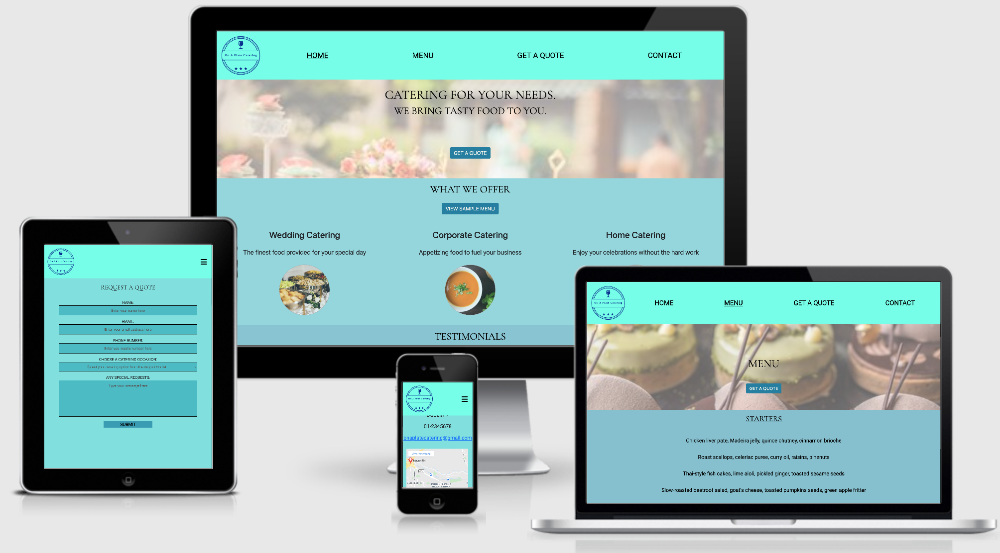
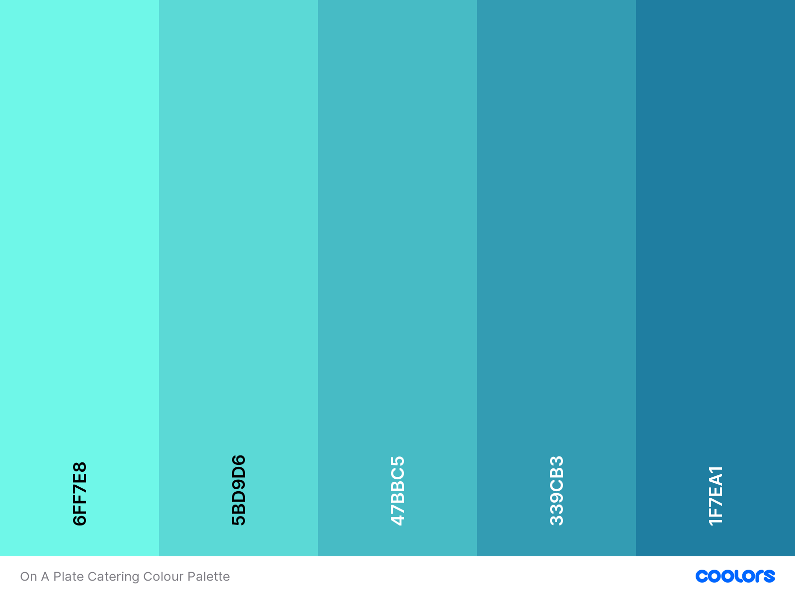
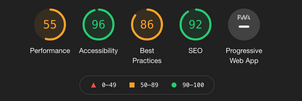
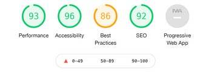
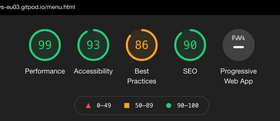
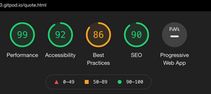
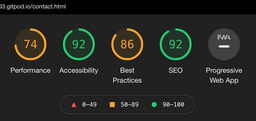
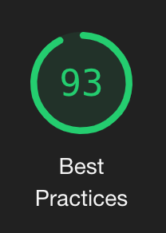
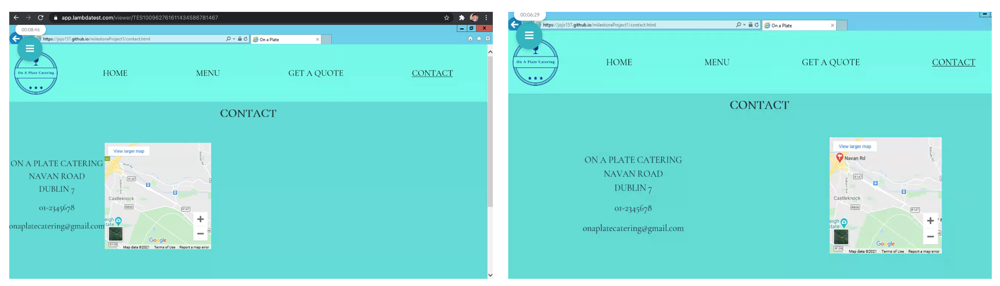

# On A Plate Catering website

## Milestone Project 1 Overview

This first milestone project will result in the creation of a static responsive front end website that will meet the business needs of On A Plate Catering and their target audience's needs. On A Plate Catering is a fictional business that wants to provide excellent food service by delivery of delicious cooked, crowd pleasing dishes.

On A Plate Catering's website is aimed at those looking to obtain high quality food service for events such as weddings, home events (birthdays, anniversaries, etc.) and corporate (conferences or smaller meetings). 

The website will be a platform to allow the business to advertise and provide sufficient information to attract new customers. The aim of the website is to allow interested customers to understand the business's service and contact the business if they would like to use this service.

View [Live Website](https://jojo157.github.io/onAPlateCatering/)

image created using [Am I responsive]()

## Table of Contents

- [UX](#ux)
  - [Goals](#goals)
    - [User Goals](#user-goals)
    - [Site Owner goals](#site-owner-goals)
  - [User Stories](#user-stories)
    - [An engaged couple](#an-engaged-couple)
    - [A business owner](#a-business-owner)
    - [An event organiser](#an-event-organiser)
    - [On A Plate Catering owner](#on-a-plate-catering-owner)
  - [Design](#design)
    - [Wireframes](#wireframes)
    - [Colour Scheme](#colour-scheme)
    - [Typography](#typography)
    - [Images](#images)
  - [Features](#features)
    - [Existing Features](#existing-features)
    - [Features Left to Implement](#features-left-to-implement)
  - [Technologies Used](#technologies-used)
    - [Frameworks and Libraries](#frameworks-and-libraries)
    - [Version Control](#version-control)
    - [Other Programs](#other-programs)
  - [Testing](#testing)
    - [Code Validation](#code-validation)
    - [Performance Testing](#performance-testing)
      - [Home Page](#home-page)
      - [Menu Page](#menu-page)
      - [Quote Page](#quote-page)
      - [Contact Page](#contact-page)
    - [User Stories Testing](#user-stories-testing)
    - [Functionality Testing](#functionality-testing)
    - [Validation Testing](#validation-testing)
    - [Compatibility Testing](#compatibility-testing)
      - [Different devices](#different-devices)
      - [Different Browsers](#different-browsers)
      - [Different Operating Systems](#different-operating-systems)
  - [Deployment](#deployment)
  - [Credits](#credits)
    - [Code](#code)
    - [Content](#content)
    - [Media](#media)
    - [Acknowledgements](#acknowledgements)

## UX

This website was created by following The Five Planes of User Experience. The planes are strategy, scope, structure, skeleton and surface. I first put myself in the shoes of the business owner and potential customer and listed all the needs I could think of, no matter how abstract. I then wrote down all the features and functions that would be necessary to meet the needs and reduced this list based on what was possible given the time constraint and level of coding knowledge.
With a reduced list of features expected to meet the user's needs, I then worked out what elements would be required to create these functions. With a more concrete idea in mind, I explored how a user would navigate to successfully meet their needs. With several prototypes drawn by hand, I decided to create a wireframe using Balsamiq to look at the outline on different devices. With this template, I started coding for mobile users and then altered the code for other devices to improve usability.

### Goals

#### User Goals

- To view the menu offered.
- To organize a corporate spread/package.
- To contact the company to book a tasting or find out more information.
- To find out what type of events are catered for.
- To view images of food provided.
- To get a quote for catering an event.

#### Site Owner goals

- To secure customers and business for food service – general and corporate.
- To increase orders & attract new clients.
- To spread awareness of brand.
- To increase social following.

### User Stories

#### An engaged couple

- I would like to be able to view a menu of food to see if I like the offering for my wedding.
- I would like to be able to request a quote.
- I would like to see reviews from other customers who used service.

#### A business owner

- I would like to be able to view a menu of food to see if I like the offering for a business event.
- I would like to be able to request a quote for a set number of people.
- I would like to see reviews from other customers who used service.
- I would like to know if the catering service can provide a regular service such as canteen food (soups, sandwiches, pastries) or just cater for specific events.

#### An event organiser

- I would like to be able to view a menu of food.
- I would like to contact to see if a special dish can be made for my event, (i.e. can you customize the menu).
- I would like to be able to request a quote.
- I would like to see reviews from other customers who used service.
- I would like to see a gallery of offerings such as cakes etc and again if  this can be customized.

#### On A Plate Catering owner

- I want to attract my target audience and obtain sufficient information from them to offer a quote.
- I want to gather new corporate clients for repeat event catering.
- I want to see if there is lunch offerings appetite for corporate clients.
- I want to increase my brand awareness and social following.
- I want to speak to customers who view my website and may be interested in service.
- I would like to offer ability to secure booking with deposit post receiving a quote.

## Design

### Wireframes

Wireframes for this project were created using Balsamiq and can be viewed at below link.

Link to [Wireframe](/assets/wireframes/onAPlateCateringWireframes.pdf)

### Colour Scheme

The colour scheme for the website was created using [Coolors](https://coolors.co/gradient-palette/) . I choose to use a gradient palette of 5 colours going from a medium light shade of cyan to dark blue. The colour gradient palette is shown below with the hex colours.
The medium light shade of cyan was used to create a conservative colour palette, combining with darker shades of blue and green. I wanted to avoid using colours that are associated with fast food marketing such as red, orange and yellow shades.

### Typography

I wanted the text to appear elegant without sacrificing readability. I browsed google fonts and selected "Cormorant Garamond" and "Roboto".
These fonts are used across the website. "Sans-serif" was used as a replacement font if "Cormorant Garamond" or "Roboto" was not available.

### Images

Images used on this website are aimed at the target audience to engage with us. Using images that look elegant while also linking up with On A Plate Catering's offering.
I believe the website achieves this without overloading images that could affect performance.

## Features

### Existing Features

On A Plate Catering website consists of 4 different pages that are responsive at all screen sizes.

Some of the features contained on the website are:

- Navigation bar
  - Assists users to easily move through the relevant pages with a layout that is intuitive, such as the hamburger icon navigation on smaller devices.
- Call To Action Button
  - The request a quote button is distributed on pages that would encourage an interested party to initiate contact for a quote. Additionally a view menu button is presented in the 'what we offer' section to entice customers.
- Request a quote feature
  - Allows all users to contact the company to get a quote for specific catering event. It helps the company obtaining sufficient information to prepare a quote.
- What we offer section Feature
  - This section gives a potential customer a very short description of our catering offering.
- Menu Section Feature
  - This section allows users to browse through a sample menu by courses. The colour layout of different courses makes it easy to distinguish them.
- Testimonials Feature
  - This section allows users to read reviews from previous customers and help inform their decision.
- Contact Section
  - This feature gives the contact details, such as address and contact number for On A Plate Catering with a google map  view of the address. Additionally, when a user clicks on the email address, the default mail provider will open with the fields To and Subject pre-filled.
- Footer
  - This section allows users to find out more about the company through its social pages using well recognised icons.

### Features Left to Implement

- Instant messaging service
  - An IM service would help to obtain more customers by proactively making the first contact.
- Payment Platform
  - The ability to secure booking with deposit post receiving a quote.
- A business lunch offering
  - This feature would provide information on packages that could be provided when the business expands into drop off lunches to businesses without a canteen.

## Technologies Used

### Frameworks and Libraries

- [Bootstrap5](https://getbootstrap.com/) was used for the navigation feature as it has a brilliant responsive navbar component and button components.
- [Font Awesome](https://fontawesome.com/) was used for the navbar hamburger icon and the social icons used in the Footer.
- [Google Fonts](https://fontawesome.com/) was used to import the font used for the website.

### Version Control

- [Git](git-scm.com) was used as a version control system.
- [GitHub](github.com) was used for repository hosting.
- [Gitpod](gitpod.io) was used as the developer platform.

### Other Programs

- [Balsamiq](https://balsamiq.com/) was used to create a mock-up of the website after exploring the strategy and scope planes of user experience for this project.
- [Google Map Iframe](https://www.embedgooglemap.net/) was used to create an embed Google Map on the contact page.
- [Hatchful](https://hatchful.shopify.com/) was used to create the company logo.
- [Image Color Picker](https://imagecolorpicker.com/) was used to get the hex colour from an image for a background.
- [Coolors](https://coolors.co/gradient-palette/) was used to create a gradient palette.
- [Pexels](www.pexels.com) was used to source free stock photos.
- [Unsplash](https://unsplash.com/) was used to source free stock photos.
- [Pixabay](https://pixabay.com/) was used to source free stock photos.
- [W3C CSS Validator](https://jigsaw.w3.org/css-validator/) was used to validate CSS code.
- [W3C Html Checker](https://validator.w3.org/) was used to validate HTML code.
- [Pic Resize](https://picresize.com/) was used to resize images available on the website to improve its performance.
- [Ligthhouse](https://GitHub.com/GoogleChrome/lighthouse) was used to audit my website. The results of the audit were considered when making improvements to improve the website performance etc.
- [Lamba Test](https://app.lambdatest.com/) was used to test the website on windows operating system.
- [Am I responsive](http://ami.responsivedesign.is/) was used to view the website across several devices at once.
- [W3C Spell checker](https://www.w3.org/2002/01/spellchecker) was used to check the spelling of the website.

## Testing

### Code Validation

Html pages were validated with [W3C Html Checker](https://validator.w3.org/nu) . Several errors were discovered that have since been fixed. The errors were:

- Error 1
  - Element button must not appear as a descendant of the a element.
    - This error was fixed by reviewing the Bootstrap documentation and putting the button class on the a element to give the same output as before.
- Error 2
  - iframe element gave error that attributes are obsolete and to use CSS instead. These attributes were margin height, margin width and frameboard scrolling.
    - I removed these attributes from the html code and put styling for the iframe in style.css instead.
- Error 3
  - The value of the for attribute of the label element must be the ID of a non-hidden form control.
    - I had forgotten the ID attribute for this form element. I added the ID for the relevant form element.

CSS pages were validated with [W3C CSS Validator](https://jigsaw.w3.org/css-validator/validator) . 2 errors were discovered.

- Error 1
  - property overscroll-behaviour doesn't exist.
    - I looked online and verified that the property does exist according to [MDN web docs](https://developer.mozilla.org/en-US/docs/Web/CSS/overscroll-behavior).
- Error 2
  - value error: font-weight 1000 is not a font-weight value.
    - I had previously looked up the maximum for this value and misinterpreted the answer to mean it was 1000. I changed this to 900 the maximum.

After fixing the errors I re-ran all HTML and CSS files through the validators and only error present is the overscroll-behaviour error that can be ignored.

### Performance Testing

Performance was tested using Lighthouse, one of google web developers tools.

#### Home Page

The first time I ran the audit on the home page, the performance was low as per image below.

The results were not unexpected as I had noticed that the page took several seconds to load. The outputs of the audit highlighted that the website image files were too large and causing performance issues.
I used [Pic Resize](https://picresize.com/) to reduce the image size without sacrificing quality. I then reran the report. I was happy the performance improved greatly across all pages and I could see this after reloading the page.

#### Menu Page

#### Quote Page

#### Contact Page

The performance was slower on this page as the map is an iframe and is known to be slower because there is an additional overhead for the browser. A future improvement would be to use JavaScript to replace the iframe.

According to Lighthouse using the a element with links to another page can pose security and performance risks. To improve my website I followed their advice and added the rel="noopener" property to all of the target="\_blank" links. This improved the best practices score across all pages from 86 to 93.

### User Stories Testing

From the user stories listed earlier the objectives of On a Plate Catering currently intends to meet can be summarised as:

- I would like to be able to view a menu of food.
- I would like to be able to request a quote.
- I would like to see reviews from other customers who used service.
- I would like to contact the company for more queries.
- I want to increase my brand awareness and social following.

From Testing, the aims are met as follows:

- I would like to be able to view a menu of food.
  - The navigation bar clearly shows the user where the menu is.
  - A call to action is shown on the home page with a button in the 'what we offer' section leading the person to the menu.
- I would like to be able to request a quote.
  - A call to action button is present on the landing page and is the first thing a user sees.
  - On the menu page another call to action button is present guiding the user to the quote page.
  - The request a quote option is in the navigation bar.
- I would like to see reviews from other customers who used service.
  - Testimonials are present on the landing page and are styled to grab the reader's attention.
- I would like to contact the company for more queries.
  - Contact section is shown in the navigation bar.
- I want to increase my brand awareness and social following.
  - The footer on all pages has links to the social pages as is standard practice for websites and the user would know to navigate to this.

### Functionality Testing

I tested the functionality of the site on a laptop first.

- I clicked on each menu option in the navigation bar and the desired page loaded as expected.
- I confirmed that the current page is underlined in the navigation bar for each page.
- I checked that the company logo on each page links back to the home page.
- I clicked on the 2 buttons on the home page and the correct pages were navigated to.
- I clicked the button on the menu page and the correct page loaded.
- I click on the social icons in the footer on each page and verified that the desired social website opens in a new page.
- On the contact page, I checked that the embedded map zoom function works and that when you click view larger map, it opens in a new page on google maps.
- On the get a quote page, I checked each input to ensure I could enter data and for the drop down list that it works as expected. I pressed the submit button to check it acts as expected. When I build on my coding skills I will have a message appearing once submit button is used.

The testing was then conducted on a mobile and the above steps were repeated including testing the toggle of the menu, toggle open and close worked on all pages as expected.

### Validation Testing

The get a quote form was tested for validation.

- I tested each input by leaving one blank at a time and checking the correct validation message is given. This worked for all cells except the drop down input.
  - I then updated the code with required property for this field and re-tested all the cells. The name, email, phone number and catering occasion fields acted as expected and are required to. The additional text field is not a required field.

### Compatibility Testing

#### Different devices

Using Google Developer tools, I viewed the website on the following devices:

- Galaxy S5
- Pixel 2
- Pixel 2 XL
- iPhone 5/6/7/8 & Plus
- iPhone X
- iPad & iPad Pro
- Surface duo
- Galaxy fold

Based on the results I decided to alter media query in styles.css to only change from mobile design to laptop for screen width of greater than 770px as the surface Duo and iPad had sections that looked squashed.

#### Different Browsers

I tested the website on:

- Google Chrome
- Safari
- Firefox
- Microsoft Edge
- Internet explorer

Differences discovered across browsers:

- The contact page form placeholder text inside fields is not centered on safari as styled. On Chrome, Firefox, Edge the placeholder text is centered.
- The property overscroll-behaviour is not compatible with safari or Internet explorer. This was expected as documented by [MDN web docs](https://developer.mozilla.org/en-US/docs/Web/CSS/overscroll-behavior).
- If using autofill, a form field changes the colour of the cell. The cell colour varies depending on the browser.
- Internet explorer does not support the property Justify-content: space evenly. This was checked on [Can I us](https://caniuse.com/?search=justify-content). All other browsers tested do.
  - I fixed this using a media query for IE as per the suggestion on [Stack Overflow](https://stackoverflow.com/questions/28417056/how-to-target-only-ie-any-version-within-a-stylesheet) by setting flex grow as per suggestion on [Stack Overflow](https://stackoverflow.com/questions/47534216/how-to-make-css-justify-contentspace-evenly-fallback-to-space-between-on-safari).

The before and after images are shown below on Internet Explorer using [Lamba Test](https://app.lambdatest.com/) .

#### Different Operating Systems

The above testing was conducted on operating systems:

- Windows 8.1
- MacOS Big Sur 11.1
- iOS 14.3

## Deployment

This milestone project was deployed to GitHub Pages using the below steps:

- Log into GitHub and locate the [On A Plate Catering](https://github.com/jojo157/onAPlateCatering) repository.
- At the top of this page navigate to "Settings" on the menu.
- Scroll down until you reach the "GitHub Pages" Section on the settings page.
- Under "Source", click the dropdown called "None" and select "main" branch.
- The page will automatically re-load.
- Scroll to the "GitHub Pages" Section and you will see the site published address displayed.

To copy the repository so that you have access to all the files and any new changes will not affect the original repository follow the below steps:

- Log into GitHub and locate the [On A Plate Catering](https://github.com/jojo157/onAPlateCatering) repository.
- On the top far right click on the fork button.
- This will add a copy of On A Plate repository to your repository.

You can add the [On A Plate Catering](https://github.com/jojo157/onAPlateCatering) repository to your local machine using the below steps:

- Log into GitHub and locate the [On A Plate Catering](https://github.com/jojo157/onAPlateCatering) repository.
- Click the "Code" button, click HTTPS and copy the link shown.
- Open terminal and change the working directory to where you want the clone repository to be.
- In the terminal, type git clone, and then paste the URL you copied earlier.
- Press enter and your local clone is now created.

## Credits

### Code

- [Bootstrap5](https://getbootstrap.com/) code was used and altered to create the responsive navigation bar and the bootstrap button classes were used.

### Content

- The text for the menu was copied from [Old Barn Catering](https://oldbarncatering.com/) .
- The rest of the content was written by myself.

### Media

- The photos used in this site were obtained from several sites where free stock photos are available [Pexels](https://www.pexels.com/) , [Unsplash](https://unsplash.com/) and [Pixabay](https://pixabay.com/) .
- The cake photo on the menu page was obtained from [Great British Chefs](https://www.greatbritishchefs.com/https://gbc-cdn-public-media.azureedge.net/) .

### Acknowledgements

- I received inspiration for this project from my wife who would like to set up a catering business in the future.
- I would like to thank my mentor Sandeep Aggarwal for his feedback and help.
- I would like to thank Code Institute's Tutor support for their help.
- I would like to thank my fellow students for their help on slack.
