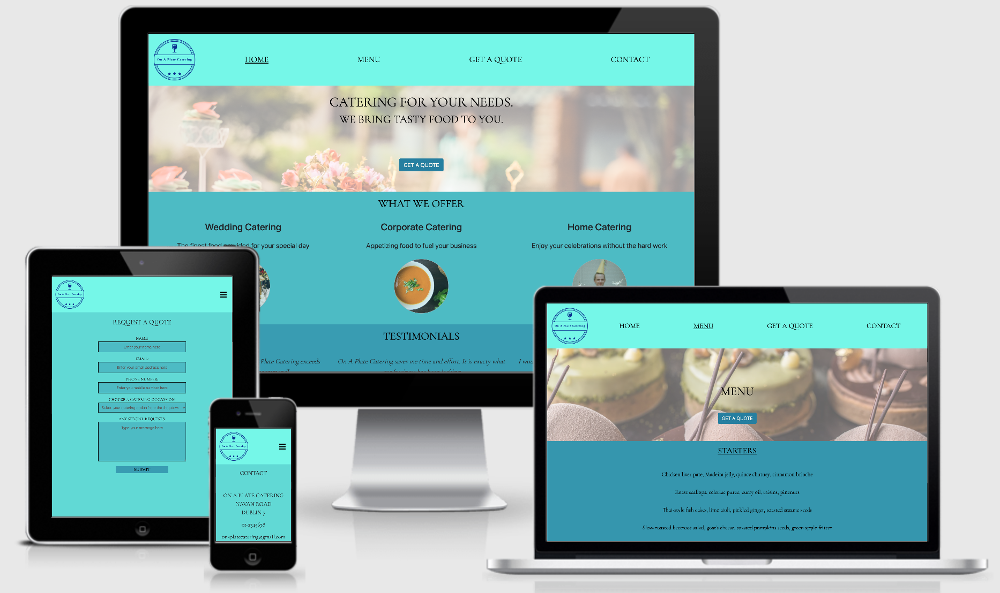

# On A Plate Catering website

## Milestone Project 1 Overview

This first milestone project will result in the creation of a static responsive front end website that will meet the business needs of On A Plate Catering and their target audiences needs.  
On A Plate Catering is a fictional business that wants to provide excellent food service by delivery of delicious cooked, crowd pleasing dishes.

On A Plate Catering's website is aimed at those looking for food service for events such as weddings, home events (birthday) and coorporate events such as a conference.
The webiste will be a platform to allow the business to advertise and to provide sufficent information to attract new customers. The aim of the website is to allow interested customers to understand the busiesses service and contact the business if they would like to use this service.

## Table of Contents

[Live Website](https://jojo157.github.io/milestoneProject1/)

## UX

### Goals

#### User Goals

- To view the menu offered
- To organize a corporate spread/package
- To contact the company to book a tasting or find out more information
- To find out what type of events are catered for
- To view images of food provided
- To get a quote for catering an event

#### Site owners goal

- To secure customers business for food service – general and corporate
- To increase orders & attract new clients
- To spread awareness of brand
- To increase social following

### User Stories

#### An engaged couple

- I would like to be able to view a menu of food to see if I like the offering for my wedding.
- I would like to be able to request a quote for a set number of people and know whats included in quote.
- I would like to see reviews from other customers who used service.

#### A business owner

- I would like to be able to view a menu of food to see if I like the offering for a business event.
- I would like to be able to request a quote for a set number of people.
- I would like to see reviews from other customers who used service.
- I would like to know if the catering service can provide a regular service such as canteen food (soups, sandwichs, pastries) or just set number events

#### An event organiser

- I would like to be able to view a menu of food
- I would like to contact to see if a special dish can be made for my event, (i.e can you customize the menu).
- I would like to be able to request a quote.
- I would like to see reviews from other customers who used service.
- I would like to see a gallery of offerings such as cakes etc and again if customize.

#### On A Plate Catering owner

- I want to attract my target audience and ask them sufficent information to offer a quote.
- I want to obtain new coorporate clients for repeat event catering.
- I want to see if there is an appetitie for lunch offerings for coorporate clients.
- I want to increase my brand awareness and social following.
- I want to speak to customers who view my website and may be interested in service. (potetial for IM facility in future)
- I would like to offer ability to secure booking with deposit post recieving a quote.

### Wireframes

Wireframes for this project were created using Balsamiq and can be viewed at below link.

Link to [Wireframe](/assets/wireframes/onAPlateCateringWireframes.pdf)

## Features

### Existing Features

On A Plate Catering website consists of 4 different pages that are responsive at all screen sizes. 
Some of the features contained on the website are:

- Navigation bar - assists users to easily move through the relevant pages with a layout that is intuitive, such as the hamburger icon naviagtion on smaller devices.
- Call To Action Button - The request a quote button is distributed on pages that would encourage an interested party to initiate contact for a quote.
- Request a quote feature - allows all users to contact the company to get a quote for catering a specific event. It helps the comapny by obtaining sufficent infomration to prepare a quote.
- What we offer section Feature - This section gives a potetial customer a very short description of our catering offering.
- Menu Section Feature - This section allows users to browse through a sample menu by courses. The colour layout of different courses makes it easy to distinguish them.
- Testimonials Feature - This section allows users to read reviews from previous customers and help inform their decision.
- Contact Section - This feature gives the contact details, such as address and contact number for On A Plate Catering with a google map of the address. 
- Footer - This section allows users to find out more about the company through its social pages using well recognised icons.

### Features Left to Implement

- Instant messaging service - An IM service would help to obtain more customers by proactively making the first contact.
- Payment Platform - The ability to secure booking with deposit post recieving a quote. 
- A business lunch offering - This feature would provide informatino on packages that could be provided when the business expands into drop off luches to businesses without a canteen.

## Technologies Used

- Frameworks and Libraries
  - [Bootstrap5](https://getbootstrap.com/) was used for the navigation feature as it has a brillant responsive navbar component and button compents. 
  - [Font Awesome](https://fontawesome.com/) was used for the navbar hamburger icon and the social icons used in the Footer. 
  - [Google Fonts](https://fontawesome.com/)  was used to import the font used for the website.           

- Wireframes
  - [Balsamiq](https://balsamiq.com/) was used to create a mock up of the website after exploring the strategy and scope planes of user exerperience for this project.

- Version Control
  - [Git](git-scm.com) was used as a version control system
  - [Github](GitHubgithub.com) was used for repository hosting
  - [Gitpod](gitpod.io) was used as the developer platform

- Other
  -  [Google Map Iframe](https://www.embedgooglemap.net/) was used to create an embed Google Map on the contact page
  -  [Hatchful](https://hatchful.shopify.com/) was used to create the company logo
  -  [Image Color Picker](https://imagecolorpicker.com/) was used to get the hex colour from an image for a background
  -  [Coolors](https://coolors.co/gradient-palette/) was used to create a gradient palette
  -  [Pexels](www.pexels.com) was used to source free stock photos
  -  [Pixabay](https://pixabay.com/) was used to source free stock photos
  -  [W3C Markup]() was used to validate markup code
  -  [W3C CSS Validator](https://jigsaw.w3.org/css-validator/validator) was used to validate CSS code
  -  [Nu Html Checker](https://validator.w3.org/nu) was used to validate HTML code
  -  [Pic Resize](https://picresize.com/b6009dede49301) was used to resize images used on the website to improve the website performance

## Testing

In this section, you need to convince the assessor that you have conducted enough testing to legitimately believe that the site works well. Essentially, in this part you will want to go over all of your user stories from the UX section and ensure that they all work as intended, with the project providing an easy and straightforward way for the users to achieve their goals.

Whenever it is feasible, prefer to automate your tests, and if you've done so, provide a brief explanation of your approach, link to the test file(s) and explain how to run them.

For any scenarios that have not been automated, test the user stories manually and provide as much detail as is relevant. A particularly useful form for describing your testing process is via scenarios, such as:

1. Contact form:
   1. Go to the "Contact Us" page
   2. Try to submit the empty form and verify that an error message about the required fields appears
   3. Try to submit the form with an invalid email address and verify that a relevant error message appears
   4. Try to submit the form with all inputs valid and verify that a success message appears.

In addition, you should mention in this section how your project looks and works on different browsers and screen sizes.

You should also mention in this section any interesting bugs or problems you discovered during your testing, even if you haven't addressed them yet.

If this section grows too long, you may want to split it off into a separate file and link to it from here.

## Deployment

This section should describe the process you went through to deploy the project to a hosting platform (e.g. GitHub Pages or Heroku).

In particular, you should provide all details of the differences between the deployed version and the development version, if any, including:

- Different values for environment variables (Heroku Config Vars)?
- Different configuration files?
- Separate git branch?

In addition, if it is not obvious, you should also describe how to run your code locally.

## Credits

### Content

- The text for section Y was copied from the [Wikipedia article Z](https://en.wikipedia.org/wiki/Z)

### Media

- The photos used in this site were obtained from ...

### Acknowledgements

- I received inspiration for this project from X
